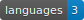
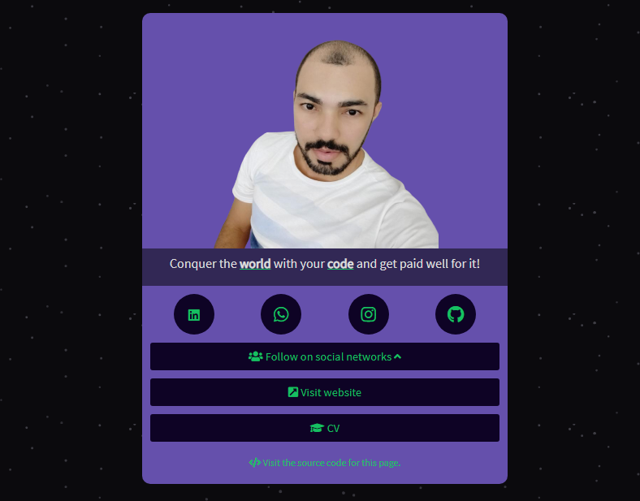

<h1 align="center">
  My Visiting Card
</h1>

    

  <a href="#rocket-technologies">Technologies</a>&nbsp;&nbsp;&nbsp;|&nbsp;&nbsp;&nbsp;
  <a href="#-project">Project</a>

 

  

## :rocket: Technologies

This project was developed with the following technologies:

- [HTML](https://developer.mozilla.org/en-US/docs/Web/HTML)
- [CSS](https://developer.mozilla.org/en-US/docs/Web/CSS)
- [JavaScript](https://developer.mozilla.org/en-US/docs/Web/JavaScript)

## 💻 Project

My Visiting Card is a customizable web page that aims to add multiple links to the Instagram bio. The goal was to create a beautiful page with an animation for my Instagram.

You can visit the page through [this link](https://ricellicarvalho.github.io/my-visiting-card).

---

Made with ♥ by Ricelli Carvalho :wave:
